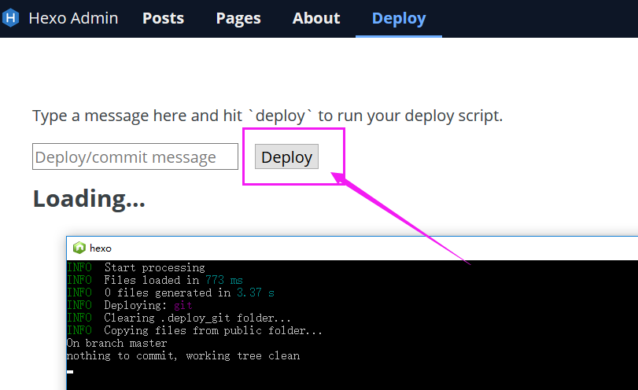

An admin UI for the [Hexo blog engine](http://hexo.io). Based off of the [Ghost](http://ghost.org) interface, with inspiration from [svbtle](http://svbtle.com) and [prose.io](http://prose.io).

## Hexo-admin

[hexo-admin](https://github.com/jaredly/hexo-admin)

## Hexo-admin with qiniu

- [x] Hexo-admin@2.1.0修改版， 添加上传图片到七牛
- [x] 修复代码预览最后空行问题
- [x] 修复windows下不能使用Deploy的问题


## 如何使用七牛

博客配置文件中 `_config.yml` 添加七牛配置属性

查看[七牛配置](docs/how-to-use-qiniu.md)

```
admin:
  qiniuCfg:
      AccessKey: 'your qiniu AK'
      SecretKey: 'your qiniu SK'
      BucketName: 'your BK Name'
      bucketHost: 'you BK Host'
```


## Deploy

点击`deploy`按钮，发布博客到静态托管网页。
使用之前，需要在博客配置文件`_config.yml`中配置好`deploy`属性

```
deploy:
  type: git
  repo:
    github: xxxxxxxxxxxx.git,master
```
### 如何发布



